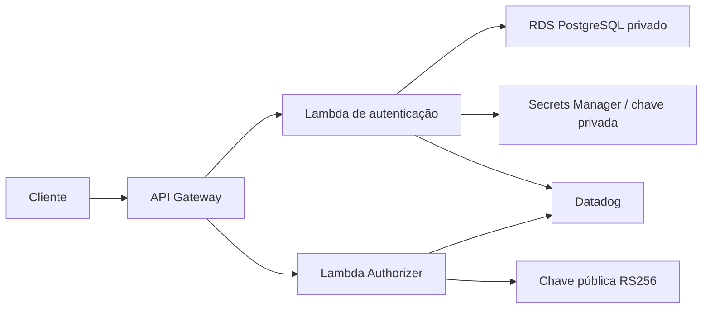

# Oficina Auth Function

Serviço serverless que autentica clientes por CPF, emite JWT RS256 e autoriza chamadas protegidas no Amazon API Gateway.

## Arquitetura



Relacionados: [API](https://github.com/maypinheiro/oficina-api), [Kubernetes](https://github.com/maypinheiro/oficina-k8s-infra) e [banco](https://github.com/maypinheiro/oficina-database-infra).

## Tecnologias

Node.js 22, TypeScript, AWS Lambda, API Gateway HTTP API, Terraform, PostgreSQL, Secrets Manager, JWT RS256, Jest, ESLint, Datadog e GitHub Actions.

## Pré-requisitos

- Node.js 22 e npm;
- Terraform 1.6+;
- para deploy: AWS Academy ativa e outputs de rede, banco e listener interno.

## Execução local e testes

```bash
npm ci
npm run lint
npm run typecheck
npm run test:coverage
npm run package
terraform -chdir=infra init -backend=false
terraform -chdir=infra validate
```

O pacote é gerado em `artifact/oficina-auth.zip`. Testes usam dependências simuladas e não exigem AWS.

## Variáveis e secrets

Terraform recebe ambiente, sub-redes, security groups, listener do backend, ARNs dos secrets e chave pública base64. O CD usa `AWS_ACCESS_KEY_ID`, `AWS_SECRET_ACCESS_KEY`, `AWS_SESSION_TOKEN`, `TF_STATE_BUCKET`, `TF_STATE_LOCK_TABLE`, `DATABASE_SECRET_ARN`, `JWT_PRIVATE_KEY_SECRET_ARN`, `JWT_PUBLIC_KEY_BASE64`, `BACKEND_LISTENER_ARN`, `PRIVATE_SUBNET_IDS_JSON`, `LAMBDA_SECURITY_GROUP_IDS_JSON`, `VPC_LINK_SECURITY_GROUP_IDS_JSON`, `DATADOG_API_KEY_SECRET_ARN` e `SMOKE_TEST_CPF`.

## Contrato e outputs

```http
POST /auth/clientes
Content-Type: application/json

{"cpf":"529.982.247-25"}
```

Sucesso retorna `token`, `tokenType=Bearer` e `expiresIn=900`. CPF inválido retorna `400`; cliente inexistente/inativo/bloqueado retorna `401` genérico. Outputs Terraform incluem URL do Gateway, IDs/ARNs das Functions e Authorizer.

## Rotas do Gateway

`POST /auth/clientes`, `/health`, `/docs`, login legado e `/public/*` são públicos. O `$default` usa Lambda Authorizer e encaminha à API por VPC Link privado.

## CI/CD, deploy e rollback

CI executa lint, tipos, testes, cobertura, empacotamento e `terraform validate`. CD manual seleciona `hml` ou `prod`, executa plan/apply, publica artefatos e smoke test. Para rollback, reaplique um SHA conhecido; mudanças Terraform devem ser corrigidas por novo plan, nunca por edição manual de state.

## Observabilidade

Functions produzem logs JSON e traces Datadog correlacionados. CPF completo, JWT e segredos não são registrados; Gateway envia access logs estruturados ao CloudWatch.

## Ambiente ativo e limitações

Endpoint cloud ativo: **não publicado nesta etapa**. A conta Academy `982623100545` usa credenciais temporárias porque OIDC/IAM pode ser bloqueado. Cognito é evolução do login administrativo, não componente já implantado.
