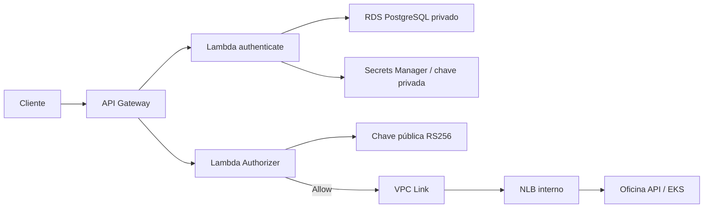

# Oficina Auth Function

Serviço serverless responsável por autenticar clientes por CPF, emitir JWT RS256 e autorizar chamadas protegidas no Amazon API Gateway.

## O que este repositório entrega

- Lambda de autenticação conectada ao RDS privado por TLS;
- Lambda Authorizer para validação do JWT;
- API Gateway HTTP API e rotas públicas/protegidas;
- integração privada com a API no EKS por VPC Link e NLB;
- chaves e credenciais obtidas pelo AWS Secrets Manager;
- logs JSON, traces e integração Datadog;
- Terraform, testes e pipelines CI/CD para `hml` e `prod`.



## Documentação

- [Arquitetura, objetivos, decisões e limitações](docs/arquitetura-e-decisoes.md)
- [Governança do repositório](docs/governanca-repositorio.md)
- [Documentação central da Fase 3](https://github.com/maypinheiro/oficina-api/tree/develop/docs/fase3)
- [Arquitetura integrada da solução](https://github.com/maypinheiro/oficina-api/blob/develop/docs/fase3/entrega-tecnica.md)
- [Matriz de rotas e permissões](https://github.com/maypinheiro/oficina-api/blob/develop/docs/fase3/matriz-rotas-permissoes.md)
- [RFC de autenticação](https://github.com/maypinheiro/oficina-api/blob/develop/docs/fase3/rfc-003-autenticacao.md)
- [Matriz completa de conformidade](https://github.com/maypinheiro/oficina-api/blob/main/docs/fase3/matriz-conformidade.md)
- [Catálogo de evidências](https://github.com/maypinheiro/oficina-api/blob/main/docs/fase3/catalogo-evidencias.md)

Repositórios relacionados: [API](https://github.com/maypinheiro/oficina-api), [Kubernetes](https://github.com/maypinheiro/oficina-k8s-infra) e [banco](https://github.com/maypinheiro/oficina-database-infra).

## Contrato principal

```http
POST /auth/clientes
Content-Type: application/json

{"cpf":"529.982.247-25"}
```

Sucesso retorna `token`, `tokenType=Bearer` e `expiresIn=900`. CPF inválido retorna `400`; cliente inexistente, inativo ou bloqueado recebe `401` genérico. CPF completo, JWT, chaves e segredos não são registrados.

## Tecnologias

Node.js 22, TypeScript, AWS Lambda, API Gateway HTTP API, Terraform, PostgreSQL, Secrets Manager, JWT RS256, Jest, ESLint, Datadog e GitHub Actions.

## Desenvolvimento e validação

```bash
npm ci
npm run lint
npm run typecheck
npm run test:coverage
npm run package
terraform -chdir=infra init -backend=false
terraform -chdir=infra validate
```

Testes locais usam dependências simuladas e não exigem AWS. O pacote é gerado em `artifact/oficina-auth.zip`.

## CI/CD

CI valida código, cobertura, empacotamento e Terraform. O CD manual seleciona `hml` ou `prod`, executa `plan/apply` e testa emissão do JWT, `/health` e uma rota protegida. Rollback consiste em reaplicar um SHA conhecido; state nunca deve ser editado manualmente.

### Como executar o deploy

1. Garanta que EKS/NLB, RDS e secrets do ambiente já foram provisionados.
2. Abra **Actions → Deploy Functions and Gateway → Run workflow**.
3. Selecione `hml` ou `prod` e acompanhe testes, pacote ZIP, Terraform plan/apply e smoke E2E.
4. O smoke armazena o JWT somente em arquivo temporário mascarado e valida `/health` e `/clientes`.
5. Baixe `auth-deployment-<env>-<sha>` para os outputs não sensíveis.

O deploy está operacional, porém o disparo automático após CI de `homolog`/`main` ainda é uma lacuna registrada na [matriz de conformidade](https://github.com/maypinheiro/oficina-api/blob/main/docs/fase3/matriz-conformidade.md).

## Ambiente validado

- Conta acadêmica: `982623100545`;
- região: `us-east-1`;
- homologação: <https://9o7vnq3io0.execute-api.us-east-1.amazonaws.com>;
- Swagger: <https://9o7vnq3io0.execute-api.us-east-1.amazonaws.com/docs>;
- evidência E2E: <https://github.com/maypinheiro/oficina-auth-function/actions/runs/34617351925>.

O endpoint depende de uma sessão ativa do AWS Academy Learner Lab. Credenciais temporárias precisam ser renovadas nos GitHub Environments a cada sessão. Cognito é evolução recomendada para funcionários, não componente implantado nesta entrega.
