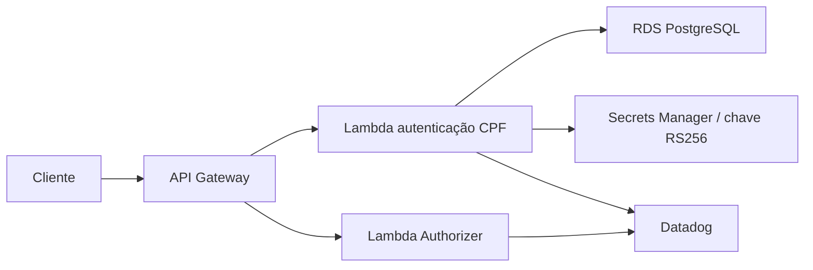

# Oficina Auth Function

Function Serverless responsável por autenticar clientes pelo CPF e autorizar
tokens no Amazon API Gateway.

## Escopo

- normalizar e validar CPF;
- consultar existência e status do cliente no RDS PostgreSQL;
- emitir JWT RS256 para clientes ativos;
- validar JWT no Lambda Authorizer;
- produzir logs JSON e traces correlacionados no Datadog;
- não registrar CPF completo, JWT ou segredos.

## Estrutura planejada

```text
src/
  handlers/authenticate.ts
  handlers/authorize.ts
  domain/cpf.ts
  application/authenticate-client.ts
  infrastructure/postgres-client.ts
infra/
  Terraform da Lambda, API Gateway e integrações
```

## Arquitetura



## Implementação

- `src/handlers/authenticate.ts`: endpoint público de autenticação;
- `src/handlers/authorize.ts`: Lambda Authorizer do API Gateway;
- `src/domain/cpf.ts`: normalização e validação exclusivamente de CPF;
- `src/application/`: permite somente cliente `ATIVO`;
- `src/infrastructure/`: PostgreSQL parametrizado, Secrets Manager e JWT RS256;
- `infra/`: duas Lambdas, logs e configuração VPC em Terraform.

## Contrato HTTP

```http
POST /auth/clientes
Content-Type: application/json
X-Correlation-Id: opcional

{"cpf":"529.982.247-25"}
```

Sucesso: `200` com `token`, `tokenType=Bearer` e `expiresIn=900`. CPF inválido
retorna `400`; cliente inexistente, inativo ou bloqueado retorna a mesma resposta
genérica `401`, evitando revelar cadastros.

## Execução e testes

```bash
npm ci
npm run lint
npm run typecheck
npm test
npm run package
```

O ZIP gerado fica em `artifact/oficina-auth.zip` e não é versionado.

## API Gateway e protecao das rotas

O Terraform cria uma HTTP API com os seguintes acessos:

| Rota | Autorizacao | Destino |
| --- | --- | --- |
| `POST /auth/clientes` | publica | Lambda de autenticacao |
| `GET /health` | publica | API no EKS via VPC Link |
| `GET /docs` e subrotas | publica | API no EKS via VPC Link |
| `POST /auth` | publica temporaria | login administrativo legado |
| `/public/*` | publica | consulta de OS e resposta de orcamento |
| demais rotas (`$default`) | JWT RS256 obrigatorio | Lambda Authorizer e API no EKS |

O backend nao fica exposto diretamente: o Gateway alcanca o listener privado por
VPC Link. O stage aplica throttling e envia logs estruturados ao CloudWatch sem
registrar o cabecalho `Authorization`. As origens CORS devem ser informadas por
ambiente; em producao nao deve ser usado curinga.

## Segredos esperados

- banco: JSON com `DATABASE_URL` e `caPem` do bundle CA do Amazon RDS;
- assinatura: JSON com `privateKeyPem` e `keyId`;
- chave pública: base64 em `JWT_PUBLIC_KEY_BASE64` no Authorizer.

O JWT contém `sub`, `scope=cliente`, `iss`, `aud`, `jti`, `iat` e `exp`. O CPF
não é incluído no token nem nos logs.

## Limitações do Learner Lab

A implantação ocorrerá na conta AWS Academy Learner Lab `982623100545`. Lambda,
API Gateway, Cognito, Secrets Manager e criação de roles precisam ser validados
na sessão real. OIDC é preferível; se estiver bloqueado, o workflow usará apenas
credenciais temporárias armazenadas em GitHub Environments.
