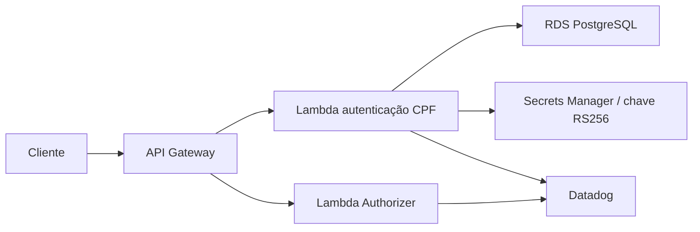

# Oficina Auth Function

Function Serverless responsável por autenticar clientes pelo CPF e autorizar
tokens no Amazon API Gateway.

## Escopo

- normalizar e validar CPF;
- consultar existência e status do cliente no RDS PostgreSQL;
- emitir JWT RS256 para clientes ativos;
- validar JWT no Lambda Authorizer;
- produzir logs JSON e traces correlacionados no Datadog;
- não registrar CPF completo, JWT ou segredos.

## Estrutura planejada

```text
src/
  handlers/authenticate.ts
  handlers/authorize.ts
  domain/cpf.ts
  application/authenticate-client.ts
  infrastructure/postgres-client.ts
infra/
  Terraform da Lambda, API Gateway e integrações
```

## Arquitetura



O código funcional será implementado na etapa de autenticação serverless. O
workflow atual valida o scaffold e será ampliado com testes e deploy AWS via
OIDC.

## Limitações do Learner Lab

A implantação ocorrerá na conta AWS Academy Learner Lab `982623100545`. Lambda,
API Gateway, Cognito, Secrets Manager e criação de roles precisam ser validados
na sessão real. OIDC é preferível; se estiver bloqueado, o workflow usará apenas
credenciais temporárias armazenadas em GitHub Environments.
