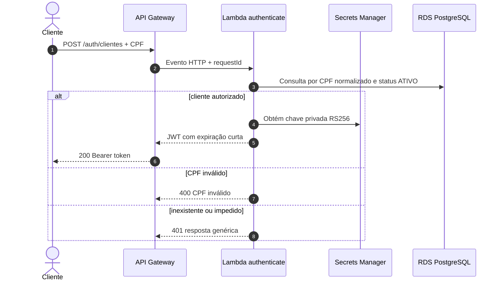
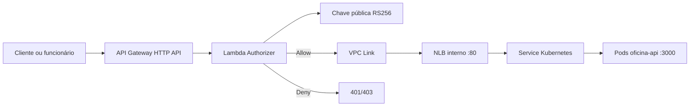

# Arquitetura e decisões técnicas

## Objetivo

Este repositório entrega a borda de identidade da Fase 3. Sua responsabilidade é autenticar clientes pelo CPF exigido no desafio, emitir JWT assinado e autorizar as rotas privadas antes de encaminhá-las para a API executada no EKS.

Não pertencem a este componente as regras de negócio da oficina, migrations, cadastro de clientes ou operação do cluster Kubernetes.

## Componentes entregues

| Componente | Responsabilidade |
|---|---|
| Lambda `authenticate` | Normaliza e valida o CPF, consulta o cliente ativo no PostgreSQL e emite JWT |
| Lambda `authorize` | Valida assinatura, algoritmo, issuer, audience e expiração do JWT |
| API Gateway HTTP API | Publica autenticação, documentação e rotas da aplicação |
| VPC Link | Liga o Gateway ao listener do NLB interno |
| Secrets Manager | Fornece chave privada de assinatura, chave pública, banco e chave Datadog |
| CloudWatch e Datadog | Recebem access logs, logs JSON, métricas e traces |

## Mapa de autenticação

## Mapa de autorização e integração privada

## Decisões técnicas

### JWT assimétrico RS256

A Function de autenticação é a única consumidora da chave privada. O Authorizer e a API recebem somente a chave pública. Essa separação reduz o impacto de comprometimento de um consumidor e permite rotação por `keyId`.

O token possui vida curta de 15 minutos e inclui `sub`, `iss`, `aud`, `iat`, `exp` e identificação do tipo de ator. CPF completo não é incluído no token nem nos logs.

### Lambda Authorizer no Gateway

Foi adotado um Lambda Authorizer porque o requisito acadêmico define autenticação por CPF e emissão própria de JWT. Ele concentra a validação antes da rede privada e mantém a API de negócio desacoplada da emissão de credenciais.

### Autenticação administrativa separada

O login legado de funcionários permanece separado do fluxo de clientes. Cognito foi registrado como evolução recomendada, mas não deve ser apresentado como componente implantado. A entrega atual preserva compatibilidade administrativa e protege o `$default` pelo Authorizer.

### Banco privado e TLS

As Lambdas são conectadas às sub-redes privadas e usam Security Group próprio. A conexão PostgreSQL exige TLS e valida o bundle CA regional da AWS. A credencial é lida do Secrets Manager e não é armazenada no pacote.

### Observabilidade sem dados sensíveis

Logs são JSON e incluem evento, ambiente, duração, `correlationId` e identificador de trace disponível. CPF, JWT, chaves e segredos são proibidos. Datadog Lambda Extension/APM complementa CloudWatch e X-Ray.

## Rotas e fronteiras de segurança

| Rotas | Política |
|---|---|
| `POST /auth/clientes` | Pública; valida payload e aplica resposta genérica para acesso negado |
| `/health`, `/docs`, `/docs/*`, `/public/*` | Públicas |
| login administrativo legado | Público apenas para obtenção da credencial administrativa |
| `$default` | JWT obrigatório via Lambda Authorizer e encaminhamento privado |

## CI/CD e rollback

CI executa lint, typecheck, testes, cobertura, empacotamento e validação Terraform. O CD manual por environment executa `plan`, `apply` e smoke tests reais de autenticação, `/health` e rota protegida. O JWT é mantido apenas em arquivo temporário do runner e nunca impresso.

Rollback é feito reaplicando um commit conhecido. State Terraform não é editado manualmente. Mudança de contrato ou chave deve manter compatibilidade durante a transição.

## Limitações do AWS Academy

- Conta única `982623100545`, região `us-east-1`.
- Credenciais STS expiram ao final da sessão do Learner Lab.
- GitHub Environments precisam ser atualizados a cada nova sessão.
- OIDC e criação de roles dedicadas podem ser bloqueados; a entrega usa `LabRole` e credenciais temporárias como contingência acadêmica.
- O endpoint pode ficar indisponível quando o laboratório encerra, mesmo sem alteração de código.

## Evidência validada

Em homologação foi validado o caminho completo: emissão de JWT, Lambda Authorizer, API Gateway, VPC Link, NLB interno e `GET /clientes`. Execução: <https://github.com/maypinheiro/oficina-auth-function/actions/runs/34617351925>.

## Rastreabilidade para avaliação

| Requisito | Implementação |
|---|---|
| Validar CPF | `src/domain/cpf.ts` e `cpf.spec.ts` |
| Consultar existência/status | `src/infrastructure/postgres-client-repository.ts` |
| Emitir JWT | `src/infrastructure/jwt.ts` |
| Function Serverless | `src/handlers/authenticate.ts` |
| Proteger rotas | `src/handlers/authorize.ts` e `infra/api-gateway.tf` |
| API Gateway/VPC Link | `infra/api-gateway.tf` |
| Logs e correlação | `src/shared/logger.ts` |
| CI/CD | `.github/workflows/ci.yml` e `cd.yml` |

Matriz completa: <https://github.com/maypinheiro/oficina-api/blob/main/docs/fase3/matriz-conformidade.md>.
